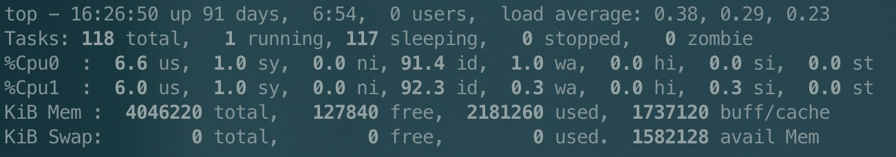

[TOC]

# 多开微信

```shell
open -n /Applications/WeChat.app/Contents/MacOS/WeChat
```


# visual studio code CMD

| 命令                |      描述      |
| :------------------ | :------------: |
| alt + commond + f   |    查找替换 $ 行尾   ^ 行首    |
| shift + alt + click |  光标多行选择  |
| shift + command + p | markdown命令行 |

```

```

# mac相关

- hosts文件
  > /etc/hosts
  ``` properties
  127.0.0.1       localhost
  255.255.255.255 broadcasthost
  ::1             localhost
  127.0.0.1   local.souche.com

  127.0.0.1   local.souche-fin.com

  127.0.0.1   local.souche-inc.com

  127.0.0.1   local.souche-inc.net

  127.0.0.1   local.dasouche-inc.net
  127.0.0.1   local.souche.dev.dasouche-inc.net

  127.0.0.1   local.dasouche.net
  # BEGIN section for OpenVPN Client SSL sites
  127.94.0.1      client.openvpn.net
  127.94.0.2      openvpn-client.vpn-v2.souche-inc.com
  ```

- 本地机器配置
    >   /opt/settings/server.properties
  ``` properties
  env=dev
  szone=souche
  ```
---


# java 命令

- dump进程信息

  > jstack PID > xxx.log


# linux命令w


## sort 排序

```
sort [-bcdfimMnr][-o<输出文件>][-t<分隔字符>][+<起始栏位>-<结束栏位>][--help][--verison][文件]

-b 忽略每行前面开始出的空格字符。
-c 检查文件是否已经按照顺序排序。
-d 排序时，处理英文字母、数字及空格字符外，忽略其他的字符。
-f 排序时，将小写字母视为大写字母。
-i 排序时，除了040至176之间的ASCII字符外，忽略其他的字符。
-m 将几个排序好的文件进行合并。
-M 将前面3个字母依照月份的缩写进行排序。
-n 依照数值的大小排序。
-o<输出文件> 将排序后的结果存入指定的文件。
-r 以相反的顺序来排序。
-t<分隔字符> 指定排序时所用的栏位分隔字符。
+<起始栏位>-<结束栏位> 以指定的栏位来排序，范围由起始栏位到结束栏位的前一栏位。
--help 显示帮助。
--version 显示版本信息。
```

## zcat linux查看gz文件

```
zcat (-lrS) 文件
-l：显示压缩包中文件的列表
-r：在目录上执行递归操作
-S：指定gzip格式的压缩包的后缀。当后缀不是标准压缩包后缀时使用此选项
```

## uniq 去重

```
uniq [-cdui] [-f<栏位>] [-s<字符位置>] [-w<字符位置>] [--help] [--version] [输入文件] [输出文件]

-c或--count 在每列旁边显示该行重复出现的次数。
-d或--repeated 仅显示重复出现的行列。
-u或--unique 仅显示出一次的行列。
-i或--ignore-case 或略大小写

-f<栏位>或--skip-fields=<栏位> 忽略比较指定的栏位。

-s<字符位置>或--skip-chars=<字符位置> 忽略比较指定的字符。

-w<字符位置>或--check-chars=<字符位置> 指定要比较的字符。

[输入文件] 指定已排序好的文本文件。如果不指定此项，则从标准读取数据；
[输出文件] 指定输出的文件。如果不指定此选项，则将内容显示到标准输出设备（显示终端）。
```

## chmod 权限设置

```
chmod [-cfvR] [--help] [--version] mode file...

mode : 权限设定字串，格式如下 :
    [ugoa...][[+-=][rwxX]...][,...]
    u 表示该文件的拥有者，g 表示与该文件的拥有者属于同一个群体(group)者，o 表示其他以外的人，a 表示这三者皆是。
    + 表示增加权限、- 表示取消权限、= 表示唯一设定权限。
    r|4 表示可读取，w|2 表示可写入，x|1 表示可执行，X 表示只有当该文件是个子目录或者该文件已经被设定过为可执行。

-c : 若该文件权限确实已经更改，才显示其更改动作
-f : 若该文件权限无法被更改也不要显示错误讯息
-v : 显示权限变更的详细资料
-R : 对目前目录下的所有文件与子目录进行相同的权限变更(即以递回的方式逐个变更)
```

## touch  修改文件或目录时间属性，不存在则创建

```
touch [-acm][-d<日期时间>][-r<参考文件或目录>] [-t<日期时间>][--help][--version][文件或目录…]

-a 改变档案的读取时间记录
-m 改变档案的修改时间记录
-c 不创建

-d 设定时间与日期，可以使用各种不同的格式
-t 设定档案的时间记录，格式与 date 指令相同
```

## [top命令详解](http://c.biancheng.net/view/1065.html)

```
top [-] [d delay] [q] [c] [S] [s] [i] [n] [b] [p]

-d 更改更新速度
-s 安全模式，取消交互式命令
-n 更新的次数，更新完退出top
-p 某个进程信息
-b 批次档模式，搭配 "n" 参数一起使用，可以用来将 top 的结果输出到档案内
```

> 16:26:50  ：系统当前时间
>
> up 91 days， 6:54 ：系统的运行时间.本机己经运行 91 天 6小时 54 分钟
>
> 0 users：当前登录了0个用户
>
> load average: 0.38,0.29，0.23:系统在之前 1 分钟、5 分钟、15 分钟的平均负载。如果 CPU 是单核的，则这个数值超过 1 就是高负载：如果 CPU 是四核的，则这个数值超过 4 就是高负载 （这个平均负载完全是依据个人经验来进行判断的，一般认为不应该超过服务器 CPU 的核数）-当前系统显示是双核

| 字段 | 用户空间占用cpu百分比                         |
| ---- | --------------------------------------------- |
| us   | 用户空间占用cpu百分比                         |
| sy   | 内核空间占用cpu百分比                         |
| ni   | 用户进程空间内改变过优先级的进程占用cpu百分比 |
| id   | 空闲cpu百分比                                 |
| wa   | 等待输入/输出的cpu时间百分比                  |


| 字段    | 描述                                                         |
| ------- | ------------------------------------------------------------ |
| PID     | 进程号                                                       |
| USER    | 该进程所属的用户                                             |
| PR      | 优先级，数值越小优先级越高                                   |
| NI      | 优先级，数值越小、优先级越高                                 |
| VIRT    | 该进程使用的虚拟内存的大小，单位为 KB                        |
| RES     | 该进程使用的物理内存的大小，单位为 KB                        |
| SHR     | 共享内存大小，单位为 KB                                      |
| S       | 进程状态（S：interruptable sleep状态、D：Uninterruptable sleep状态、R：运行状态、Z：僵尸状态、T：Stop模式，进程要么处于被调试状态） |
| CPU     | 该进程占用 CPU 的百分比                                      |
| MEN     | 该进程占用内存的百分比                                       |
| TIME    | 该进程共占用的 CPU 时间                                      |
| COMMAND | 启动命令                                                     |

## 查看系统版本

```
cat /proc/version
```

## nohup

用途：不挂断地运行命令。
语法：nohup Command [ Arg ... ] [　& ]
描述：nohup 命令运行由 Command 参数和任何相关的 Arg 参数指定的命令，忽略所有挂断（SIGHUP）信号。在注销后使用 nohup 命令运行后台中的程序。要运行后台中的 nohup 命令，添加 & （ 表示“and”的符号）到命令的尾部。

操作系统中有三个常用的流：
　　0：标准输入流 stdin
　　1：标准输出流 stdout
　　2：标准错误流 stderr

　　一般当我们用 > console.txt，实际是 1>console.txt的省略用法；< console.txt ，实际是 0 < console.txt的省略用法。

 \> nohup ./start-dishi.sh >output 2>&1 &

解释：

1. 带&的命令行，即使terminal（终端）关闭，或者电脑死机程序依然运行（前提是你把程序递交到服务器上)； 

2. 2>&1的意思 

　　这个意思是把标准错误（2）重定向到标准输出中（1），而标准输出又导入文件output里面，所以结果是标准错误和标准输出都导入文件output里面了。 至于为什么需要将标准错误重定向到标准输出的原因，那就归结为标准错误没有缓冲区，而stdout有。这就会导致 >output 2>output 文件output被两次打开，而stdout和stderr将会竞争覆盖，这肯定不是我门想要的. 

　　这就是为什么有人会写成： nohup ./command.sh >output 2>output出错的原因了

## export

Linux export 命令用于设置或显示环境变量。

在 shell 中执行程序时，shell 会提供一组环境变量。export 可新增，修改或删除环境变量，供后续执行的程序使用。export 的效力仅限于该次登陆操作。

**语法**

```
export [-fnp][变量名称]=[变量设置值]
```

**参数说明**：

- -f 　代表[变量名称]中为函数名称。
- -n 　删除指定的变量。变量实际上并未删除，只是不会输出到后续指令的执行环境中。
- -p 　列出所有的shell赋予程序的环境变量。

