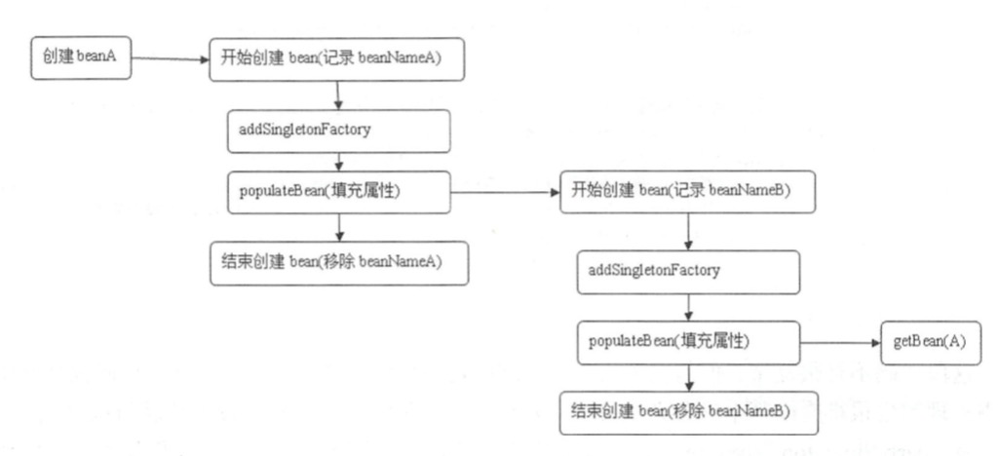

- 1.BeanDefinition 是什么?

Spring容器启动时读取配置信息将各种bean的基本配置信息读取到对应BeanDefinition，用于生成bean时调用。所以BeanDefinition就像是一个存储了特定信息的模版文件；允许BeanFactoryPostProcessor（例如PropertyPlaceholderConfigurer）内省和修改属性值和其他bean元数据。（即后面对Bean的操作就直接对BeanDefinition进行，例如拿到这个BeanDefinition后，可以根据里面的类名、构造函数、构造函数参数，使用反射进行对象创建）

- 2.BeanFactory

是IOC容器的核心接口，用于配置，创建，管理各种Bean，只不过BeanFactory是一个顶层接口为实现类提供了基础的规范

- 3.FactoryBean

为IOC容器中Bean的实现提供一个简单的工厂和装饰模式，可以在getObject()方法中增加复杂的逻辑

[BeanFactory  and FactoryBean 区别](https://www.cnblogs.com/redcool/p/6413461.html)

- 4.spring 解决循环依赖

什么是循环依赖：循环依赖即是循环引用，指多个bean之间互相持有对方。Spring的循环依赖分为：1、构造器循环依赖；2、setter循环依赖就是属性循环依赖；

   单例模式：
   - 构造器循环依赖

       创建bean前执行下面这个方法
       beforeSingletonCreation这个方法的作用是检查bean是否在创建中，如果是抛出异常BeanCurrentlyInCreationException
       createBeanInstance创建bean实例，如果形成了 A - B - A
       则在beforeSingletonCreation中抛出异常

   - setter循环依赖

       ```java
       // org.springframework.beans.factory.support.AbstractAutowireCapableBeanFactory.doCreateBean
       // 为了避免后期循环依赖，可以在bean初始化完成前将创建实例的ObjectFactory加入工厂
       addSingletonFactory(beanName,
         // 主要用于解决循环引用问题，对bean再一次依赖引用，主要应用SmartInstantiationAware BeanPostProcessor
         // 其中我们熟知的AOP就是在这里将advice动态织入bean中，若没有则直接返回bean，不做任何处理。
         () -> getEarlyBeanReference(beanName, mbd, bean)
       );
       ```

        setter循环依赖如下图，当出现A - B -
        A的时候getBean（A）就会调用上面的getEarlyBeanReference并不会重新创建bean。参考：

        ```java
       org.springframework.beans.factory.support.AbstractBeanFactory.doGetBean ->
       org.springframework.beans.factory.support.DefaultSingletonBeanRegistry.getSingleton(java.lang.String)
        ```

       


   原型模式：Spring容器不缓存"prototype"作用域的bean，所以无法提前暴露一个创建中的bean，不能解决循环依赖。

- 5.Spring的lookup-method 和 replace-method

    两个方法的配置放在BeanDefinition#
    这两种方法用的不多，一些在xml里面配置的bean可能用的着。如果在代码里切换实现类可以使用@Autowired、@Qualifier("xxx")这两个注解替代，替换方法可以使用aop

    1. lookup-method 获取器注入

    一种特殊的注入方式，把一个方法声明为返回某种类型的bean，实际返回的bean是在配置文件里面配置的，此方法可用在设计有些可插拔的功能上，解除程序依赖

    2. replace-method

    可以在运行时用新的方法替换现有的方法

- 6.BeanPostProcessor

BeanPostProcessor：在调用客户 自定义初始化方法前、后分别会调用 BeanPostProcessor 的 postProcessBeforelnitialization 和 postProcessAfterlnitialization 方法，使用户可以根据自己的业务需求进行响应的处理

- 7.BeanFactoryPostProcessor

BeanFactoryPostProcessor：bean工厂载入所有bean的配置之后执行postProcessBeanFactory方法。

> BeanDefinitionRegistryPostProcessor继承了BeanFactoryPostProcessor；具体执行参考org.springframework.context.support.PostProcessorRegistrationDelegate.invokeBeanFactoryPostProcessors(org.springframework.beans.factory.config.ConfigurableListableBeanFactory, java.util.List<org.springframework.beans.factory.config.BeanFactoryPostProcessor>)
    执行顺序规则如下：
    1、先执行BeanDefinitionRegistryPostProcessor，后执行BeanFactoryPostProcessor
    2、先执行实现了PriorityOrdered，在执行实现了Ordered，其它

- 8.BeanFactory和ApplicationContext的区别

    - BeanFactory是Spring最底层的接口提供了bean的实例化和获取bean,管理bean之间的依赖关系。初始化容器时未实例化bean，第一次获取时才初始化
    - ApplicationContext初始化容器时实例化所有单实例bean，继承BeanFactory处理提供基础功能还继承其它类扩展了更多功能：
      > MessageSource：国际化
      > ResourcePatternResolver：访问资源
      > ApplicationEventPublisher：消息发送响应
      > HierarchicalBeanFactory：载入多个（有继承关系）上下文，使得每一个上下文都专注于一个特定的层次，比如应用的web层
      > EnvironmentCapable：获得一个Environment实例
- 9.ApplicationContext 上下文的生命周期

    ApplicationContext 上下文的生命周期
    #### 启动流程
    1. 获取 beanFactory
       1. 创建beanFactory
       2. 加载所有BeanDefinitions
    2. **给 AbstractApplicationContext 子类一个可以修改 beanFactory 的入口**
    3. 注册以及实例化所有BeanFactoryPostProcessor实现类，触发 **BeanDefinitionRegistryPostProcessor.postProcessBeanDefinitionRegistry(BeanDefinitionRegistry registry)** 以及 **BeanFactoryPostProcessor.postProcessBeanFactory(beanFactory)**
    4. 注册以及实例化所有BeanPostProcessor实现类
    5. 初始化 **Message 源**
    6. 初始化消息广播器 **applicationEventMulticaster**
    7. **给 AbstractApplicationContext 子类一个可以初始化其他 bean 的入口**
    8. 将所有 Listener bean,注册到消息广播器中
    9. 初始化剩余非懒加载实例（非惰性实例）
       1. 执行InstantiationAwareBeanPostProcessor的postProcessBeforeInstantiation方法
       2. 反射构建bean（使用构造方法构建或者使用FactoryMethod进行构建）
       3. 执行MergedBeanDefinitionPostProcessor的postProcessMergedBeanDefinition方法（autowired注解就是通过此方法实现各种类型的预解析的，这里给了一个机会修改BeanDefinition的部分属性，但某些属性已经填充入bean中了。）
       4. bean注入属性：
          1. （1）执行InstantiationAwareBeanPostProcessor的postProcessAfterInstantiation方法
          2. （2）执行InstantiationAwareBeanPostProcessor的postProcessProperties方法（autowired注解在这注入Bean中）
          3. （3）将属性应用到bean中
       5. 初始化bean
          1. （1）调用 Aware 系列指定方法
             1. a. BeanNameAware.setBeanName(beanName)
             2. b.BeanClassLoaderAware.setBeanClassLoader(bcl)
             3. c.BeanFactoryAware.setBeanFactory(BeanFactory beanFactory)
          2. （2）执行BeanPostProcessor的postProcessBeforeInitialization方法
          3. （3）如果是(InitializingBean)的 bean执行afterPropertiesSet()
          4. （4）执行init-method
          5. （5）执行BeanPostProcessor的postProcessAfterInitialization方法
    10. 结束 refresh 阶段
        1.  清空上下文级别资源缓存
        2.  初始化生命周期处理器（lifecycleProcessor）
        3.  触发所有实现了Lifecycle接口的bean（start 方法会不会真正触发还要看其他配置）
        4.  发布 **ContextRefreshedEvent** 事件

- 10.spring提供的BeanPostProcessor主要有哪些

    * **InstantiationAwareBeanPostProcessor**
      * 1. Object **postProcessBeforeInstantiation**(Class<?> beanClass, String beanName)
        * 作用阶段：实例化之前运行
        * 功能：返回 Bean 对象可以代替需要创建的 Bean 使用，短路作用
        * 注意点：如果需要进行短路，BeanPostProcessors的postProcessAfterInitialization可以配合使用。

    * **MergedBeanDefinitionPostProcessor**
      * 2. void **postProcessMergedBeanDefinition**(RootBeanDefinition beanDefinition, Class<?> beanType, String beanName);
        * 作用阶段：postProcessAfterInstantiation 之前
        * 功能：修改 RootBeanDefinition

    * **InstantiationAwareBeanPostProcessor**
      * 3. boolean **postProcessAfterInstantiation**(Object bean, String beanName)
        * 作用阶段：实例化之后运行
        * 功能：该阶段 spring 自动装配还未开始，返回false 可以提前结束自动注入（不进行自动注入）
      * 4. PropertyValues **postProcessProperties**(PropertyValues pvs, Object bean, String beanName
        * 作用阶段：postProcessAfterInstantiation 之后， postProcessBeforeInitialization之前
        * 功能：提供修改pvs，当然也可以修改Bean

    * **BeanPostProcessor**
      * 5. Object postProcessBeforeInitialization(Object bean, String beanName)
        * 作用阶段：在初始化之前运行
        * 功能：修改 Bean
      * 6. Object **postProcessAfterInitialization**(Object bean, String beanName):
        * 作用阶段：在初始化之后运行
        * 功能：修改 Bean

    * **SmartInstantiationAwareBeanPostProcessor**
      * 7. Object postProcessBeforeInitialization(Object bean, String beanName)
        * 作用阶段：**存在循环依赖时**，初始化之前
        * 功能：修改 Bean

- 11.spring的监听器是怎么注册的？在何时注册的？

    org.springframework.context.support.AbstractApplicationContext#refresh
        public void refresh() throws BeansException, IllegalStateException {
            synchronized (this.startupShutdownMonitor) {
                ...
                try {
                    ...
                    // Check for listener beans and register them.
                    // 在所有注册的bean中查找Listener bean,注册到消息广播器中
                    registerListeners();

                    // Instantiate all remaining (non-lazy-init) singletons.
                    // 初始化剩下的单实例（非惰性），通过getBean的方式
                    finishBeanFactoryInitialization(beanFactory);

                    // Last step: publish corresponding event.
                    // 完成刷新过程，通知声明周期处理器LifecycleProcessor刷新过程，同时发出ContextRefreshedEvent通知别人
                    finishRefresh();
                }
                ...
            }
        }


    将容器中已经有的 ApplicationListener 加入到 applicationEventMulticaster.defaultRetriever.**applicationListeners** 缓存中。

    以及未实例的所有 **ApplicationListener 类型**的 bean 加入到 applicationEventMulticaster.defaultRetriever.**applicationListenerBeans** 缓存中，注意:
    * 这里没有实例化，**只存了 beanName**。实例发生在 ListenerRetriever.getApplicationListeners 中。
    * 这里只是保存了**实现了ApplicationListener类型的Listener**，**@EventListener 并不是在这里获取的**


        protected void registerListeners() {
            // Register statically specified listeners first.
            for (ApplicationListener<?> listener : getApplicationListeners()) {
                getApplicationEventMulticaster().addApplicationListener(listener);
            }

            // Do not initialize FactoryBeans here: We need to leave all regular beans
            // uninitialized to let post-processors apply to them!
            String[] listenerBeanNames = getBeanNamesForType(ApplicationListener.class, true, false);
            for (String listenerBeanName : listenerBeanNames) {
                getApplicationEventMulticaster().addApplicationListenerBean(listenerBeanName);
            }

            // Publish early application events now that we finally have a multicaster...
            Set<ApplicationEvent> earlyEventsToProcess = this.earlyApplicationEvents;
            this.earlyApplicationEvents = null;
            if (earlyEventsToProcess != null) {
                for (ApplicationEvent earlyEvent : earlyEventsToProcess) {
                    getApplicationEventMulticaster().multicastEvent(earlyEvent);
                }
            }
        }


    @EventListener 详见处理类 **EventListenerMethodProcessor#afterSingletonsInstantiated**，在 finishBeanFactoryInitialization 中触发注册的,
    所以想要让 @EventListener 起作用就一定要在类上加上注解或者其他方法，让识别到该类（常见的是加 **@Compont**）。

    EventListenerMethodProcessor 是 SmartInitializingSingleton 的实现，走到这里就会进行 afterSingletonsInstantiated 操作。

    **afterSingletonsInstantiated** 中会进行方法上的筛选（判断方法上是否带有 **@EventListener** 注解），然后根据这个方法动态生成 **ApplicationListenerMethodAdapter** 存入缓存中。

        org.springframework.beans.factory.support.DefaultListableBeanFactory
        public void preInstantiateSingletons() throws BeansException {
            ...
            // Trigger post-initialization callback for all applicable beans...
            for (String beanName : beanNames) {
                Object singletonInstance = getSingleton(beanName);
                if (singletonInstance instanceof SmartInitializingSingleton) {
                    final SmartInitializingSingleton smartSingleton = (SmartInitializingSingleton) singletonInstance;
                    if (System.getSecurityManager() != null) {
                        AccessController.doPrivileged((PrivilegedAction<Object>) () -> {
                            smartSingleton.afterSingletonsInstantiated();
                            return null;
                        }, getAccessControlContext());
                    }
                    else {
                        smartSingleton.afterSingletonsInstantiated();
                    }
                }
            }
        }


- 12.spring事件监听的实现原理

    用 applicationContext.publishEvent(T event) 方法注册 event，底层还是会调用这个方法。

        org.springframework.context.event.SimpleApplicationEventMulticaster

        public void multicastEvent(final ApplicationEvent event, @Nullable ResolvableType eventType) {
            ResolvableType type = (eventType != null ? eventType : resolveDefaultEventType(event));
            Executor executor = getTaskExecutor();
            for (ApplicationListener<?> listener : getApplicationListeners(event, type)) {
                if (executor != null) {
                    executor.execute(() -> invokeListener(listener, event));
                }
                else {
                    invokeListener(listener, event);
                }
            }
        }
    **getApplicationListeners(event, type)**： 已经帮我们根据 eventType 找出需要监听的 listener。

    **invokeListener(listener, event);**
    * 普通实现了 ApplicationContextLinstener 的类，则直接调用 onApplicationEvent(E event)
    * 使用 @EventListener 的类，则是调用 onApplicationEvent(ApplicationEvent event) 方法，
        org.springframework.context.event.ApplicationListenerMethodAdapter
        public void onApplicationEvent(ApplicationEvent event) {
            processEvent(event);
        }
        public void processEvent(ApplicationEvent event) {
            Object[] args = resolveArguments(event);
            if (shouldHandle(event, args)) {
                Object result = doInvoke(args);
                if (result != null) {
                    handleResult(result);
                }
                else {
                    logger.trace("No result object given - no result to handle");
                }
            }
        }
